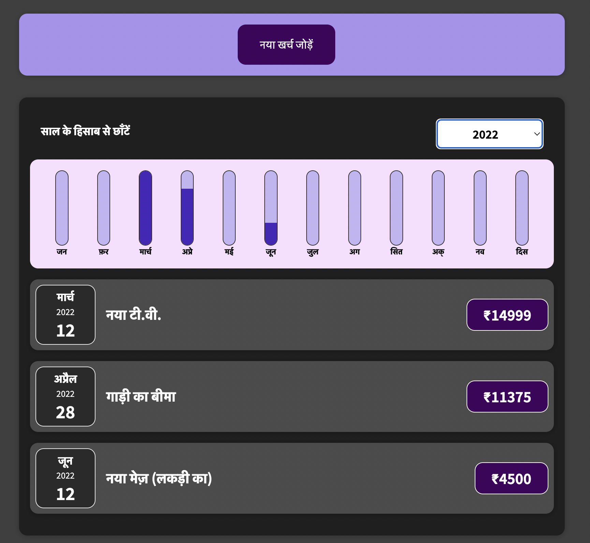

# Hi, I'm Mohit Thapliyal! 👋

##### I'm a full stack developer.
##### Organised, Responsive, Helpful, Observant and Trustworthy are some of the adjectives to define me.
# Expense List

Here you can see your expenses and can see the comparision between the expenses of different months.


## Tech Stack

**Client:** React


## 🛠 Skills
Javascript, HTML, CSS, React


## Run Locally

Clone the project

```bash
  git clone https://github.com/Mohit-Thapliyal/Expenses-react-app.git
```

Go to the project directory

```bash
  cd Expenses-react-app
```

Install dependencies

```bash
  npm install
```

Start the server

```bash
  npm run start
```


## 🔗 Links
[](https://www.linkedin.com/in/mohit-thapliyal-b20104146/)


## Screenshots




